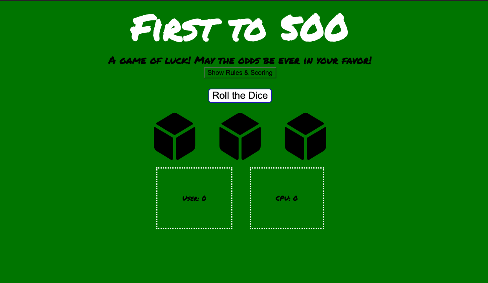
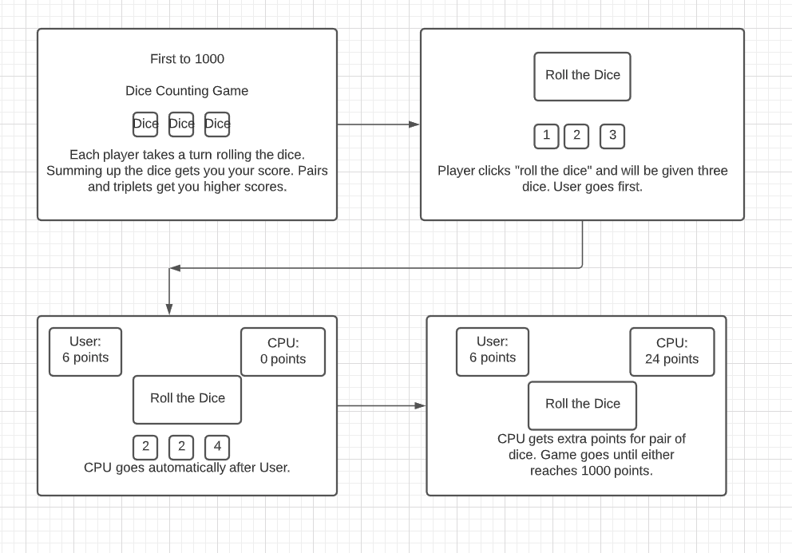
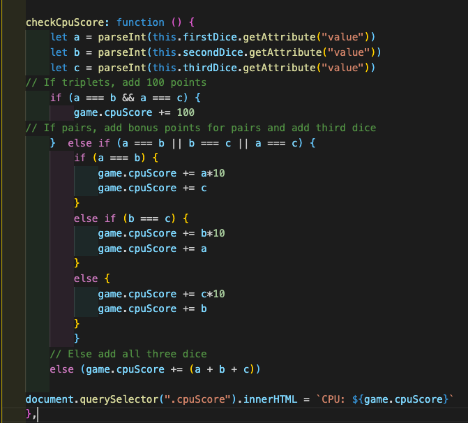

# First-to-100-Game

First to 100 is a game of luck between you and the computer. Roll the dice to see if you can score higher than the computer! Each roll gets you closer and closer. Cross your fingers for pairs and triplets!

### Motivation

Being a fan of all things game boards, rolling dice, and pure chance, I mulled over what game would be fun to emulate. Having already worked on a game with cards, I decided a game of dice would be a good starting off project. Also being a lover of numbers, I figured why not make this a little more challenging with multiple rules of points measuring. Guided by the game Farkle, I created First to 500.

### Screenshots

##### Jump Off

### User Stories & Wireframes

Above wireframe was first set to 1000 before realizing the game might take too long for purposes here.

Each player gets one turn at a time, and three dice to roll. The point of the game is to get to 500 points. With each turn, your dice will add up by their own value to your score. However, there are chances to get bonus points, and they are as follows:

* Rolling a pair of 1s gets you 10 extra points
* Rolling a pair of 2s gets you 20 extra points
* Rolling a pair of 3s gets you 30 extra points
* Rolling a pair of 4s gets you 40 extra points
* Rolling a pair of 5s gets you 50 extra points
* Rolling a pair of 6s gets you 60 extra points
* Rolling triplets gets you 100 extra points

### Technologies & Code Snippets

Being able to add third dice that does not match was a hurdle. This solved that. 

Having the computer not run all the functions in a second, I had to set multiple timeouts between runs.

